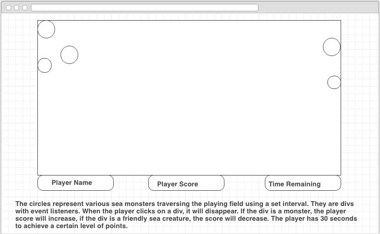

# waterGame
Monster Fish was created using HTML, CSS and jQuery:
The fish are represented with a .Gif set as a background image on divs. Flexbox was used to center the boardgame and space the user score, timer and name.
CSS was used to style the pages.
For animations, I used click events on the divs that changed the background CSS to an explosion .gif. 
Also, jquery was used to create the timer box and the scoring system. 
When the clock runs out, the player's score must be greater than 30 for a winner message to show, else, it displays the 'try again' message. 

Unsolved problems: 
I spent the bulk of my time on this project trying to refactor my code. My workflow went like this: 
1. get one element to operate as intended. 
2. recreate first element multiple times with slight variations. 
3. try to refactor code to act on all elements, not just one at a time. 

For example, I created a random number to use as the fish's swim speed and a for loop to iterate through the fish, but I was only able to get all the fish
moving at the same random speed, which looked weird, so I reverted back to my lengthy code.

